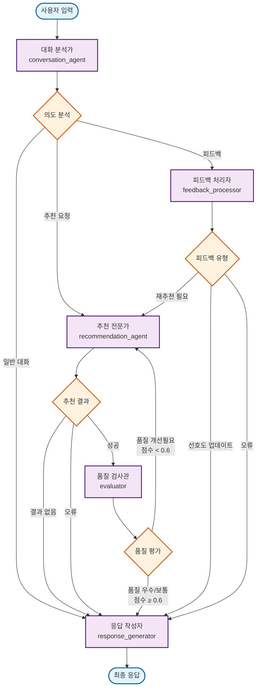
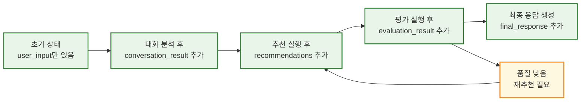
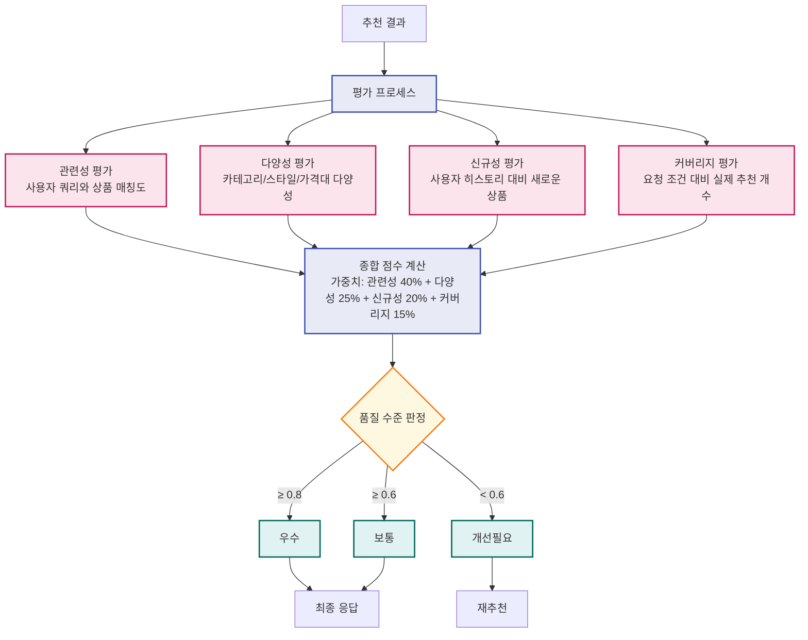

# LangGraph 패션 추천 시스템 워크플로우

## 전체 워크플로우 다이어그램



## 상태 변화 다이어그램



## 데이터 흐름 다이어그램

```mermaid
flowchart TD
    %% 데이터 흐름
    USER[사용자 입력<br/>"스트릿 반팔 추천해줘"] --> CONV
    
    CONV --> CONV_DATA[대화 분석 결과<br/>intent: recommendation_request<br/>extracted_info: {style: "스트릿", category: "상의"}]
    
    CONV_DATA --> REC
    REC --> REC_DATA[추천 결과<br/>[{product_id: "1", name: "스트릿 그래픽 반팔"},<br/>{product_id: "2", name: "오버핏 로고 반팔"}]]
    
    REC_DATA --> EVAL
    EVAL --> EVAL_DATA[평가 결과<br/>overall_score: 0.75<br/>quality_level: "보통"<br/>relevance_score: 0.8]
    
    EVAL_DATA --> RESP
    RESP --> FINAL[최종 응답<br/>"스트릿한 반팔 추천해드릴게요!<br/>1. 스트릿 그래픽 반팔<br/>2. 오버핏 로고 반팔<br/>📊 품질 평가: 보통 (점수: 0.750)"]
    
    %% 재추천 루프
    EVAL_DATA --> LOOP[품질 개선필요<br/>재추천 루프] --> REC
    
    %% 스타일
    classDef input fill:#e3f2fd,stroke:#1565c0,stroke-width:2px
    classDef data fill:#f1f8e9,stroke:#33691e,stroke-width:2px
    classDef output fill:#fff3e0,stroke:#e65100,stroke-width:2px
    
    class USER input
    class CONV_DATA,REC_DATA,EVAL_DATA data
    class FINAL output
```

## 평가 메트릭 다이어그램



## 노드별 상세 기능

### 대화 분석가 (conversation_agent)
- **입력**: 사용자 원본 메시지
- **처리**: 의도 분석, 정보 추출, 컨텍스트 파악
- **출력**: 추천 필요 여부, 추출된 정보, 사용자 선호도

### 추천 전문가 (recommendation_agent)
- **입력**: 대화 분석 결과, 필터 조건, 사용자 선호도
- **처리**: SQL/Vector DB 기반 추천, 하이브리드 결합
- **출력**: 추천 상품 목록, 신뢰도 점수, 추천 이유

### 품질 검사관 (evaluator)
- **입력**: 추천 결과, 사용자 컨텍스트
- **처리**: 4가지 메트릭 평가, 종합 점수 계산
- **출력**: 품질 수준, 개선 제안사항

### 피드백 처리자 (feedback_processor)
- **입력**: 사용자 피드백, 현재 컨텍스트
- **처리**: 피드백 분석, 필터 조건 업데이트
- **출력**: 업데이트된 선호도, 재추천 필요 여부

### 응답 작성자 (response_generator)
- **입력**: 모든 상태 정보
- **처리**: 최종 응답 텍스트 생성
- **출력**: 사용자에게 보여줄 최종 메시지 